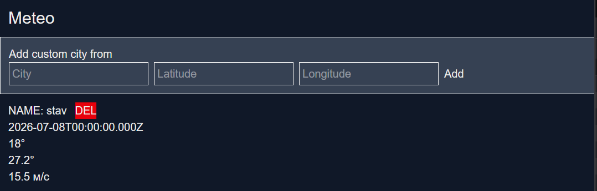
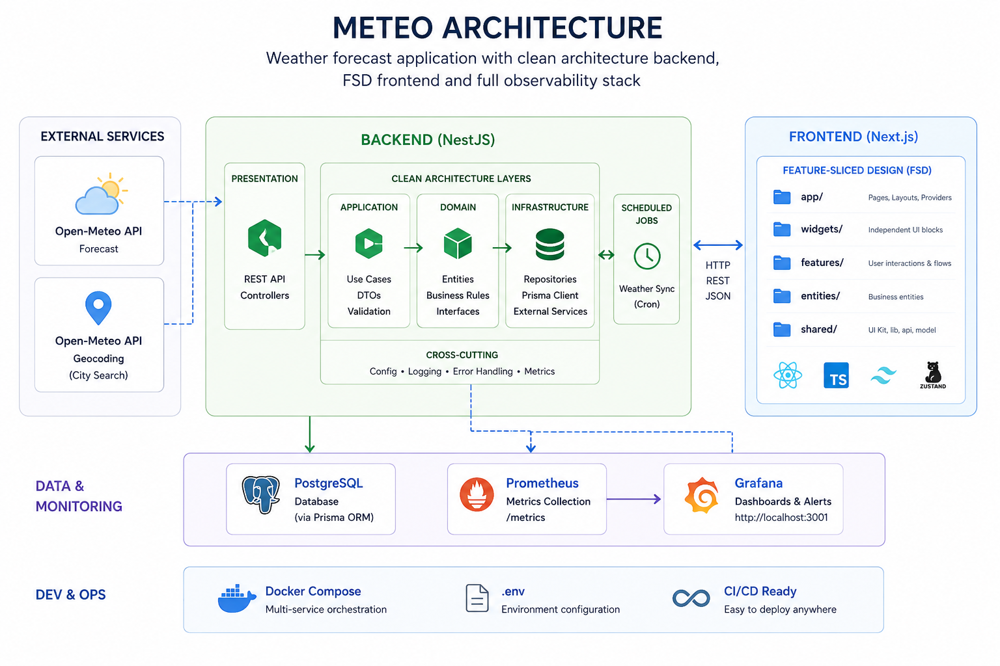

# Meteo

A full-stack weather application built with Next.js and NestJS. The project periodically synchronizes weather forecasts from Open-Meteo, stores them in PostgreSQL, and provides monitoring with Prometheus and Grafana.

## Preview



## Features

- Search cities using Open-Meteo Geocoding API
- 14-day weather forecast
- Automatic weather synchronization
- PostgreSQL + Prisma ORM
- Prometheus metrics
- Grafana dashboards
- One-command Docker deployment

---

## Architecture



### Backend

- NestJS
- Prisma ORM
- PostgreSQL
- Scheduled weather synchronization
- REST API
- Prometheus metrics

### Frontend

- Next.js
- React
- TypeScript
- Zustand
- Tailwind CSS

### Monitoring

- Prometheus
- Grafana

---

## Tech Stack

| Frontend | Backend | Database | Monitoring | DevOps |
|----------|----------|----------|------------|--------|
| Next.js | NestJS | PostgreSQL | Prometheus | Docker |
| React | Prisma | | Grafana | Docker Compose |
| TypeScript | REST API | | | |

---

## Quick Start

Generate the environment file:

```bash
./env.sh
```

Start the project:

```bash
docker compose up -d --build
```

---

## Services

| Service | URL |
|---------|-----|
| Frontend | http://localhost:3000 |
| Backend | http://localhost:8000 |
| Prometheus | http://localhost:9090 |
| Grafana | http://localhost:3001 |

Default Grafana credentials:

```
login: admin
password: admin
```